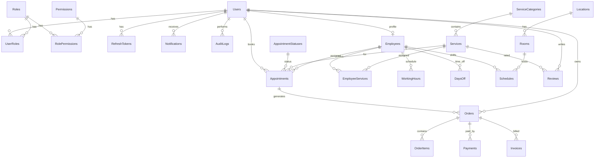

# Appointment Booking System

Sistem web për menaxhimin e termineve (rezervime shërbimesh, staf, pagesa dhe komunikim real-time). Projekt zhvillimi për **Laboratorike 2 — Viti Akademik 2025/2026**, **Stack #4: Microsoft Stack**.

---

## Përmbledhje

Aplikacioni lejon klientët të rezervojnë termine, punonjësit të menaxhojnë oraret e tyre, dhe administratorët të administrojnë shërbimet, stafin, lokacionet, pagesat dhe raportet. Chat-i dhe njoftimet funksionojnë në kohë reale përmes SignalR, ndërsa mesazhet e chat-it ruhen në MongoDB.

---

## Technology Stack

| Shtresa | Teknologji |
|---------|------------|
| Backend | .NET 10 Web API |
| Frontend | React 18 + Vite + TypeScript |
| DB SQL | Microsoft SQL Server (LocalDB) |
| DB NoSQL | MongoDB (mesazhet e chat-it) |
| ORM | Entity Framework Core 10 |
| Autentifikim | JWT + Refresh Tokens (BCrypt) |
| Real-time | SignalR |
| UI | Material UI (MUI) |
| State | React Context + `useReducer` |
| Pagesa | Stripe |
| i18n | Shqip, Anglisht, Gjermanisht |

---

## Arkitektura

Projekti ndjek **Clean Architecture** me katër shtresa:

```
Domain        → Entitetet dhe interfaces (IRepositories)
Persistence   → DataContext, Repositories, Migrations, Seed
Application   → Services, DTOs, Business Logic
API           → Controllers, SignalR Hubs, DI, Middleware
```

```
Projekti/
├── API/              # Web API, Hubs, Controllers
├── Application/      # Services dhe DTOs
├── Domain/           # Entities, Constants
├── Persistence/      # EF Core, Repositories, Migrations
└── Frontend/         # React + Vite
```

---

## Kërkesat paraprake

Para instalimit, sigurohu që ke:

| Softuer | Version i rekomanduar |
|---------|----------------------|
| [.NET SDK](https://dotnet.microsoft.com/download) | 10.x |
| [Node.js](https://nodejs.org/) | 20+ |
| SQL Server LocalDB | (vjen me Visual Studio ose SQL Server Express) |
| [MongoDB Community](https://www.mongodb.com/try/download/community) | 6+ (për chat) |
| Git | — |

Verifiko instalimin:

```powershell
dotnet --version
node --version
npm --version
sqllocaldb info
```

---

## Instalimi

### 1. Klono repository-n

```powershell
git clone <repository-url>
cd Appointment-booking-systems
```

### 2. Backend — restore dhe databaza

```powershell
cd Projekti\API
dotnet restore
dotnet ef database update --project ..\Persistence
```

Kjo krijon databazën `AppointmentBookingDb` në LocalDB dhe aplikon migrimet EF Core (26 tabela + seed data për role, permissions dhe admin).

### 3. Frontend — dependencies

```powershell
cd ..\Frontend
npm install
```

---

## Konfigurimi

Konfigurimi kryesor ndodhet në `Projekti/API/appsettings.json`.

### SQL Server (DefaultConnection)

```json
"ConnectionStrings": {
  "DefaultConnection": "Server=(localdb)\\mssqllocaldb;Database=AppointmentBookingDb;Trusted_Connection=True;TrustServerCertificate=True;"
}
```

Për SQL Server Express ose instancë tjetër, ndrysho `Server=` sipas mjedisit tënd.

### MongoDB (chat)

```json
"MongoDbSettings": {
  "ConnectionString": "mongodb://localhost:27017",
  "DatabaseName": "AppointmentBookingDb",
  "ChatMessagesCollectionName": "chat_messages"
}
```

Sigurohu që shërbimi MongoDB është duke u ekzekutuar para se të përdorësh chat-in.

### JWT

```json
"JwtSettings": {
  "SecretKey": "<your-secret-key>",
  "Issuer": "AppointmentSystem",
  "Audience": "AppointmentUsers",
  "ExpiryInMinutes": 60
}
```

> **Siguria:** Për prodhim, vendos `SecretKey` dhe çelësat e Stripe në [User Secrets](https://learn.microsoft.com/en-us/aspnet/core/security/app-secrets) ose variabla mjedisore — mos i commit-o në Git.

```powershell
cd Projekti\API
dotnet user-secrets set "JwtSettings:SecretKey" "your-secret-here"
dotnet user-secrets set "Stripe:SecretKey" "sk_test_..."
```

### Stripe (pagesa online)

```json
"Stripe": {
  "SecretKey": "",
  "PublishableKey": "pk_test_..."
}
```

Pa `SecretKey`, backend-i i pagesave nuk funksionon plotësisht; UI mbetet i disponueshëm për demonstrim.

### CORS

Frontend-i pritet në `http://localhost:5173`. Backend-i në `http://localhost:5213`.

---

## Ekzekutimi

Hap **dy terminale**:

**Terminal 1 — Backend**

```powershell
cd Projekti\API
dotnet run
```

API: `http://localhost:5213`  
OpenAPI (Development): `http://localhost:5213/openapi/v1.json`

**Terminal 2 — Frontend**

```powershell
cd Projekti\Frontend
npm run dev
```

Aplikacioni: `http://localhost:5173`

---

## Kredencialet e paracaktuara (Seed)

| Roli | Email | Fjalëkalimi |
|------|-------|-------------|
| Admin | `admin@elearning.com` | `Admin123` |

Përdoruesit e rinj regjistrohen nga faqja **Register** (roli Client caktohet automatikisht).

Punonjësit e krijuar nga admini marrin fjalëkalimin fillestar `Employee123!`; klientët e shtuar nga admini `Client123!` — ndryshimi pas hyrjes së parë rekomandohet.

---

## Endpoint-et kryesore

| Modul | Route bazë |
|-------|------------|
| Auth | `/api/Auth` (login, register, refresh, logout) |
| Users | `/api/User` |
| Appointments | `/api/AppointmentsUser`, `/api/AppointmentsAdmin` |
| Staff | `/api/Employees`, `/api/Services`, `/api/Locations`, `/api/Rooms` |
| Orders & Payments | `/api/OrderUser`, `/api/PaymentUser` |
| CMS (Settings) | `/api/SystemSettings` |
| Files | `/api/Files` |
| Reports | `/api/Reports` |
| Audit Logs | `/api/AuditLog` |
| Chat history | `/api/ChatHistory` |

### SignalR Hubs

| Hub | URL |
|-----|-----|
| Notifications | `http://localhost:5213/hubs/notifications` |
| Chat | `http://localhost:5213/hubs/chat` |

Autentifikimi për hubs përdor JWT në query string (`?access_token=...`).

---

## Databaza — Tabelat (26)

**Autentifikim & sistemi:** Users, Roles, UserRoles, Permissions, RolePermissions, RefreshTokens, AuditLogs, Notifications, SystemSettings, Files

**Domeni:** ServiceCategories, Services, Locations, Rooms, Employees, EmployeeServices, WorkingHours, DaysOff, Schedules, Appointments, AppointmentStatuses, Payments, Orders, OrderItems, Invoices, Reviews

**NoSQL:** koleksioni `chat_messages` në MongoDB

### Diagrami ERD (përmbledhës)



---

## Features shtesë (Additional Features)

| # | Feature | Përshkrim |
|---|---------|-----------|
| 2 | CMS | Admin ndryshon `SystemName` dhe `LogoUrl` nga Settings — ruhet në DB |
| 3 | Online Payment | Integrim Stripe (UI + backend webhook) |
| 4 | Data Export | Eksport CSV / Excel / JSON nga Reports |
| 5 | Dynamic Reports | Raporte dinamike në panelin e adminit |

---

## Komanda të dobishme

```powershell
# Apliko migrime të reja
dotnet ef database update --project Projekti\Persistence --startup-project Projekti\API

# Krijo migrim të ri pas ndryshimeve në entitete
dotnet ef migrations add EmriMigrimit --project Projekti\Persistence --startup-project Projekti\API

# Build frontend për prodhim
cd Projekti\Frontend
npm run build

# Lint frontend
npm run lint
```

---

## Troubleshooting

| Problem | Zgjidhje |
|---------|----------|
| `Cannot connect to LocalDB` | Ekzekuto `sqllocaldb start MSSQLLocalDB` ose instalo SQL Server Express |
| Chat nuk funksionon | Nis MongoDB (`mongod`) dhe kontrollo `MongoDbSettings` |
| CORS error | Sigurohu që frontend është në portën **5173** dhe API në **5213** |
| 401 pas login | Kontrollo skadimin e JWT (60 min) ose rifresko token-in |
| Port 5173 i zënë | Ndrysho portën në `Frontend/vite.config.ts` ose lirë procesin |

---

## Ekipi & Lënda

- **Lënda:** Laboratorike 2  
- **Viti akademik:** 2025/2026  
- **Stack:** Microsoft (.NET + React + MSSQL + MongoDB)

---

## Licenca

Projekt akademik — UBT.
